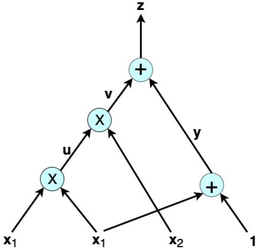

# Series ZK - Introduction

## Principle
Transform normal problems into a polynomial problems.    
Let $f(x) = t(x)s(x)$, $t(x)$ is public, we need to prove we know a polynomial which can devide exactly $t(x)$.

### Statement
* [Simplify](https://crypto.stanford.edu/~buenz/papers/zether.pdf)  
A ZK-proof for the statement:  
$$ st: \{(a, b, c, ...; x, y, z, ...) : f(a, b, c, ...; x, y, z, ...)\} $$    
    means that the prover shows knowledge of x, y, z, . . . such that f(a, b, c, . . . , x, y, z, . . .) is true, where a, b, c, . . . are public variables. We use st[a, b, c, . . .] to denote an instance of st where the variables a, b, c, . . . have some fixed values.
* Example  

### Circle
* [R1CS](https://www.zeroknowledgeblog.com/index.php/the-pinocchio-protocol/r1cs)
* [Rank-1 Constraint System](https://tlu.tarilabs.com/cryptography/rank-1)  
  

Easy for algebraic operations, but hard for logical operations.

### Example
A non-interactive ZK (NIZK) proof system includes algorithms $(Setup_{nizk}, Prove, Verify_{nizk)}$, where $Setup_{nizk}$ outputs some public parameters, $Prove$ generates a proof for a statement given a witness, and $Verify_{nizk}$ checks if the proof is valid w.r.t the statement.  
Some features are a) correct, an honest prover can produce a valid proof; b) zero-knowledge, a verifier learns nothing from the proof but the validity of the statement, and c) sound, a computationally bounded prover cannot convince a verifier of a false statement. 
`Σ protocols`, which is used in [zether](https://crypto.stanford.edu/~buenz/papers/zether.pdf), with the Fiat-Shamir transform applied, have all these properties. 

## Sulotuion
`zk-SNARKs1` and `zk-STARKs` permeate almost everything zero-knowledge in blockchain.

* [Differences between zk-SNARK and zk-STARK](https://blog.pantherprotocol.io/zk-snarks-vs-zk-starks-differences-in-zero-knowledge-technologies/): Setup, the length of proof.
* [Details of zk-SNARK](./zk%20SNARK.md)

## Engineering
### Circom

## Application
### Privacy
* [ private payment system](https://github.com/ConsenSys/anonymous-zether)
* [Privacy-Cross-Chain-Demo](https://github.com/dantenetwork/Privacy-Cross-Chain-Demo/tree/main/Anonymous)

### Rollup
Note that the `Rollup` implement by zk can be considered as an instance of VC(verifiable computation), which is general capacity expansion. Another instance of VC is TEE(Trusted Execution Environment), one implementation of which is [Intel SGX](https://medium.com/@integritee/tee-101-how-intel-sgx-works-and-why-we-use-it-at-integritee-5cb2957c050f). Intel SGX is based on hardware and has a high performance in engineering, but it depends on the centralized certificate of Intel company. Actually the certificate can be decentralized by a MPC method.  

Unfortunately, there

## Projects
* [scroll](https://hackmd.io/@yezhang/S1sJ2cEWY): Rollup, GPU

## Reference
* [1] P.S.L.M. Barreto, H.Y. Kim, B.Lynn, and M.Scott, Efficient algorithms for
pairing-based cryptosystems, Crypto 2002, LNCS 2442, pp.354-368, SpringerVerlag, 2002.
* [2] D. Boneh, B. Lynn, and H. Shacham, Short signatures from the Weil pairing,
Asiacrypt 2001, LNCS 2248, pp.514-532, Springer-Verlag, 2001.
* [3] S. D. Galbraith, K. Harrison, and D. Soldera, Implementing the Tate pairing,
ANTS 2002, LNCS 2369, pp.324-337, Springer-Verlag, 2002.
* [Why And How ZkSnark Works](http://petkus.info/papers/WhyAndHowZkSnarkWorks.pdf)